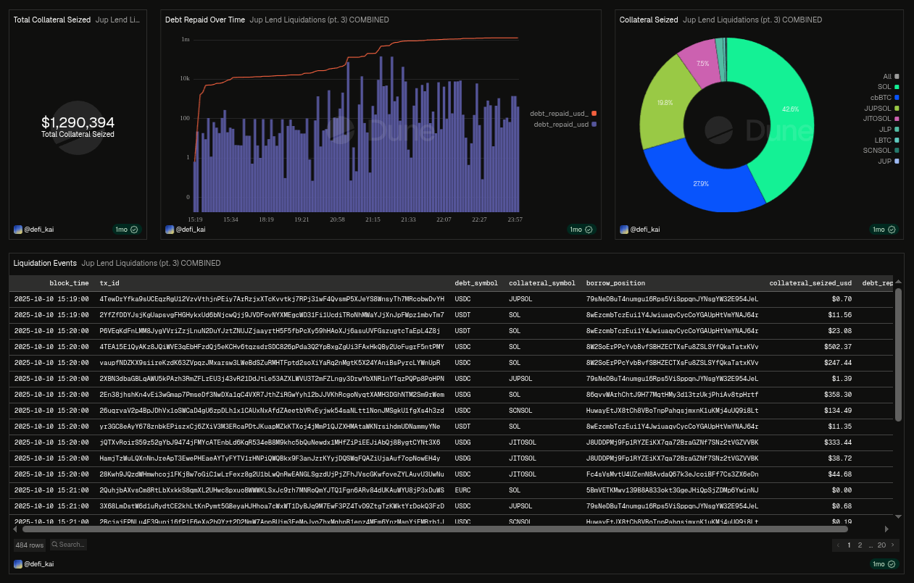

# Jupiter Lend Liquidation Risk

Jupiter Lend is a lending venue on Solana and part of Jupiter's broader product suite. The protocol uses Fluid's lending architecture, adapted for Solana.

This project examines Jupiter Lend's onchain lending activity, beginning with historical liquidations. The liquidation dataset is built using DuneSQL and reconstructs events from raw data to identify liquidated positions, collateral seized, debt repaid, liquidators, and the use of flashloans.

The project is being extended into risk analysis and stress testing.

- `data/`: October 10, 2025 liquidation and flashloan dataset exports and schemas.
- `sql/`: Reusable DuneSQL queries for producing the datasets.
- `docs/`: Liquidation methodology and validation notes.

## Dashboard

## Roadmap

- [x] Historical liquidation dataset
- [x] Historical flashloan dataset
- [x] October 10, 2025 liquidation analysis
- [ ] Position-level risk modeling
- [ ] Distance-to-Liquidation (DTL)
- [ ] Stress testing
- [ ] Liquidation-at-risk analysis

## Data Sources

- Dune
  - [`solana.instruction_calls`](https://dune.com/data/solana.instruction_calls)
  - [`prices.hour`](https://dune.com/data/prices.hour)

## High-Level Methodology

Jupiter Lend liquidation events are reconstructed from raw Solana instructions on Dune:

1. Identify Jupiter Lend liquidation transactions using the protocol's liquidation instruction discriminator.
2. Extract the relevant accounts from each liquidation instruction, including the position, collateral mint, and debt mint.
3. Associate each liquidation with its liquidator and identify transactions that use flashloans.
4. Decode inner liquidity instructions to determine the amount of debt repaid and collateral withdrawn.
5. Normalize raw token amounts using token decimals.
6. Join historical price data to estimate the USD value of collateral seized and debt repaid.

This produces a transaction-level dataset that can be used to analyze liquidation activity by account, asset, liquidator, and transaction.

## Major Findings So Far

Analysis of the October 10, 2025 liquidation cascade found:

- Approximately $1.29M in liquidations were processed through Jupiter Lend.
- Fewer than 50% of flashloan-assisted liquidations used liquidity from Kamino.
- Nine wallet accounts took part in liquidations.
- The three largest liquidated collateral assets were SOL (approximately $567k), cbBTC (approximately $372k), and JUPSOL (approximately $264k).

## Known Limitations

The historical Solana price data available through Dune's [`prices.hour`](https://dune.com/data/prices.hour) table has hourly resolution, which cannot capture minute-by-minute price movements around individual liquidation events. USD-denominated values for collateral seized and debt repaid should therefore be treated as estimates rather than exact transaction-time valuations.

More precise price data would allow better estimation of the value captured during individual liquidations. The dataset does not attempt to label the difference between collateral value and debt repaid as realized liquidator profit.
